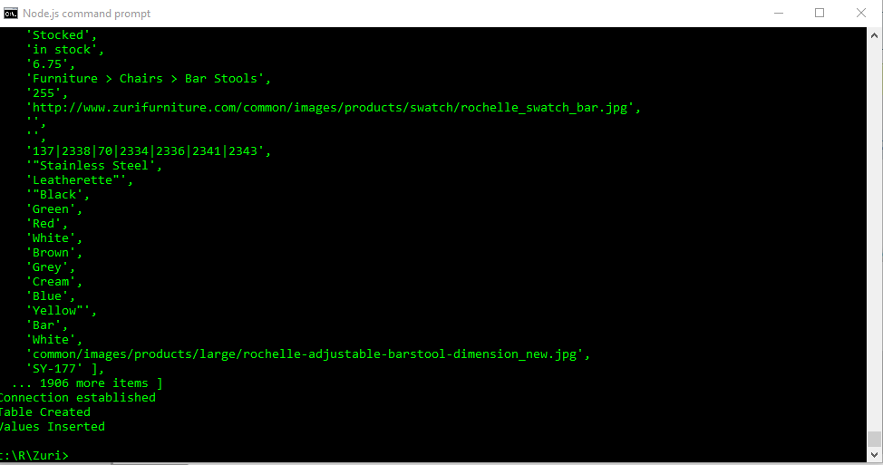
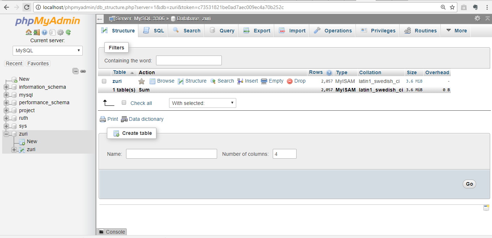
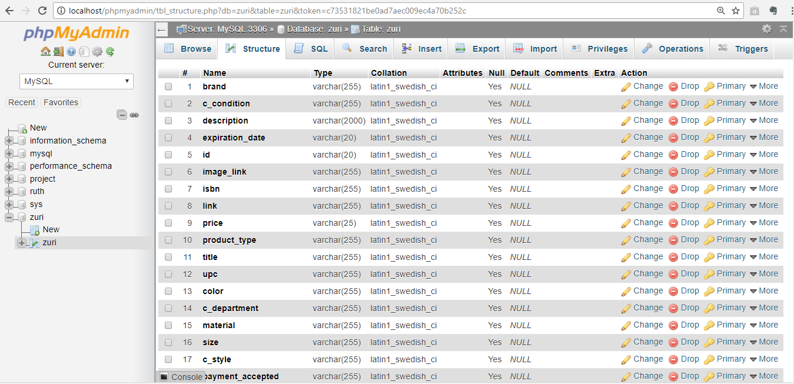
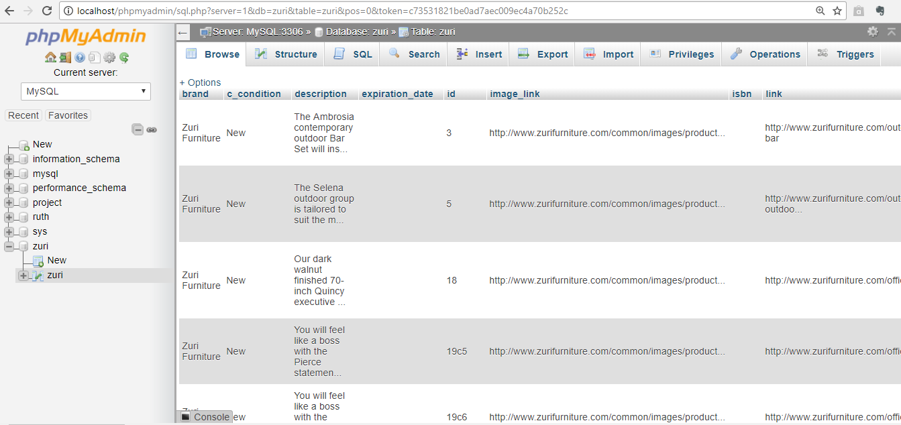

# Parse-a-file-and-save-to-DB
Requirements:
NodeJS envoirnment
MySQL Database
Text Editor
Database File(.txt, csv, sql or any)

Tasks Done:
The txt.file is converted to csv file.
This file is parsed. 
The data is stored in MYSQL database.
NodeJs is used to parse the csv file and stored it in database. 

Steps:
1.	Read the CSV file via fs node module.
2.	Make connections to the Mysql database. 
3.	Parse the csv file.
4.	Write a query to create table ‘zuri’ in Zuri database.
5.	Write a query to push the parsed csv file values to the database.

Running the program:
1.	Extract the folder
2.	Save it in a particular location
3.	Have your NodeJS envoirnment running.
4.	Go the location you saved the extracted folder.
5.	Run the following commands:
npm init
npm install express
npm install csvjson
npm install mysql
node main.js
	That’s it 

Command Prompt Output:

 

Database Output:

 
 
 
  
 

 

 

 
